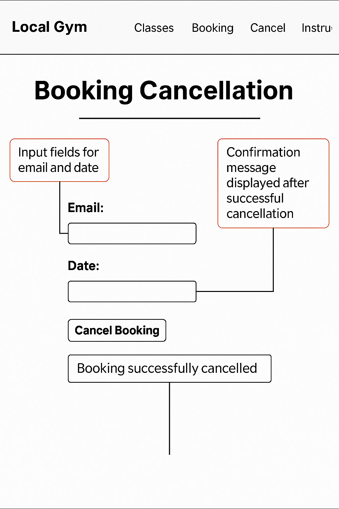

# Local Gym Class Booking System

A responsive web application that allows users to browse, book, and cancel gym classes. The system also supports waitlists, automatically promoting users when spots become available. Built with HTML, CSS, and JavaScript, and deployed via GitHub Pages and Heroku.

---

## Features

- Browse weekly classes by day and see live availability with total capacity, spots left, and waitlist length.  
- Book classes by selecting a specific date and time.  
- Cancel bookings easily, with automatic waitlist promotion.  
- Instructor profiles include bios, skills, and years of experience.  
- Responsive design works on both desktop and mobile.  
- Data is stored in localStorage for persistence across sessions.

---

## User Stories

- As a user, I want to see which classes are available on each day so I can plan my week.  
- As a user, I want to know how many spots are left in a class so I can decide quickly.  
- As a user, I want to book a class by selecting a date and time so I can secure my place.  
- As a user, I want to cancel a booking easily so I can free up my spot if I cannot attend.  
- As a user, I want to be added to a waitlist if a class is full so I still have a chance to attend.  
- As a user, I want to be promoted from the waitlist automatically if a spot opens up.  
- As a visitor, I want to view instructor profiles so I know who is leading the classes.

---

## User Experience (UX)

- Clear navigation with links to Classes, Booking, Cancellation, and Instructors.  
- Consistent layout and easy-to-follow forms.  
- Responsive design adapts to smaller screens.  
- Accessible forms with clear labels.  
- Instructor profiles add trust and personality.

---

## Wireframes

The following wireframes were created to plan the layout and user flow of the Gym Class Booking System. They illustrate the structure of the homepage, booking form, cancellation form, and instructor profiles before development began.

### Homepage / Navigation

- Header with site title and navigation links (Classes, Booking, Cancel, Instructors).  
- Clear, consistent navigation across all pages.  
- Responsive layout for desktop and mobile.

---

### Classes Page

- Dropdown to select a day of the week.  
- Dynamic display of classes with name, instructor, time, capacity, spots left, and waitlist length.

---

### Booking Form

- Input fields for name, email, and date.  
- Dropdown populated with available classes for the selected date.  
- Confirmation message displayed after booking.

---

### Cancellation Form

- Input fields for email and date.  
- Confirmation message displayed after successful cancellation.  
- Automatic waitlist promotion if applicable.

---

### Instructor Profiles

- Grid of instructor cards with name, gender, years of experience, skills, classes taught, and bio.  
- Responsive design for mobile view.

> Note: Wireframes were created using Figma and hand-drawn scans. They served as a guide for building the final responsive layout.

---

## Technologies Used

- **HTML5** for structure  
- **CSS3** for styling and responsiveness  
- **JavaScript (ES6)** for interactivity and logic  
- **localStorage** for client-side persistence  
- **Heroku** and **GitHub Pages** for deployment

---

## Testing

The following table outlines the main features tested, the steps taken, the expected results, and the actual results observed.

| Feature                | Test Steps                                                                 | Expected Result                                                                 | Actual Result     |
|------------------------|----------------------------------------------------------------------------|---------------------------------------------------------------------------------|-------------------|
| Browse Weekly Classes  | Select a day from the dropdown                                             | Classes for that day are displayed with name, time, instructor, capacity, spots | Works as expected |
| Booking a Class        | Enter name, email, select date and time, submit form                      | Booking is confirmed, spots left decreases by one                               | Works as expected |
| Booking Full Class     | Fill booking form for
